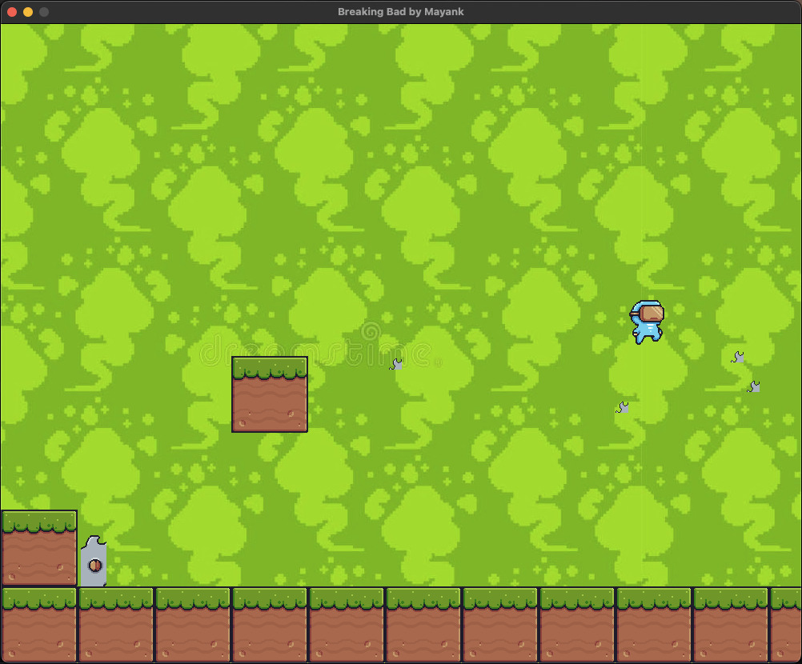

# Breaking Bad Python Platformer Game


Welcome to the Breaking Bad Python Platformer Game! This game is a simple platformer where you control a character through various obstacles and collects crystal meth. Be careful of the hazards, and try to collect as many crystals as possible to increase your score!


## Getting Started


### Prerequisites

Make sure you have Python installed on your system. You can download Python from [python.org](https://www.python.org/).

### Installing Dependencies

You need to install the `pygame` library to run this game. You can install it using the following command:

```bash
pip install pygame
```

## How to Play

1. Run the `breaking_bad_game.py` script.
2. Use the **left arrow** key to move left and the **right arrow** key to move right.
3. Press the **spacebar** to jump.
4. Avoid obstacles and collect crystal meth to increase your score.





## Game Features

- Player character with animations.
- Crystal collection system.
- Obstacles and hazards to avoid.
- Score tracking.

## Credits

- Game developed by Mayank.
- Background music: [background_music.mp3](assets/music/background_music.mp3).
- Background image: [bb.jpg](assets/Background/bb.jpg).

## Acknowledgments

Special thanks to the Pygame library for making game development in Python enjoyable and freecodecamp.org.

Enjoy playing the Breaking Bad Python Platformer Game!
